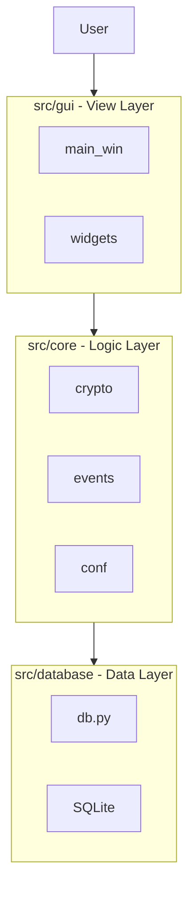

# CryptoSafe-Manager

CryptoSafe Manager — это приложение на Python для безопасного хранения учетных данных (логинов и паролей).
Текущая версия представляет собой архитектурный фундамент будущего менеджера паролей.

Целью данной работы является разработка архитектурной основы настольного приложения для безопасного хранения учетных данных с использованием принципов:
1) модульности и масштабируемости
2) архитектурного паттерна MVC
3) изоляции криптографической логики
4) работы с локальной базой данных SQLite
5) подготовки проекта к дальнейшему расширению и внедрению реальных механизмов защиты данных

Дорожная карта проекта:

Sprint 1: Фундамент (Текущий)

● Создание зашифрованной базы данных (SQLite)

● Модульная архитектура (MVC)

● Базовый графический интерфейс (Tkinter)

● Заглушки для шифрования и системы событий

Sprint 2: Управление ключами

● Реализация генерации мастер-ключа

● Функции входа и выхода из системы

Sprint 3: Настоящее шифрование

● Замена заглушек на AES-256-GCM

● Безопасное хеширование паролей

Sprint 4: Работа с буфером обмена

● Автоматическая очистка буфера обмена по таймеру

Sprint 5: Журналирование действий (Audit Logging)

● Полноценная запись всех действий пользователя

● Просмотр логов в интерфейсе

Sprint 6: Импорт и экспорт

● Импорт из других менеджеров паролей

● Экспорт данных (шифрованный и открытый)

Sprint 7: Автоблокировка и безопасность

● Блокировка при бездействии

● Защита от атак

Sprint 8: Упаковка и развертывание

● Создание исполняемых файлов (.exe, .app)

● Docker-контейнеры


Диаграмма архитектуры





Структура проекта


```
cryptosafe-manager/
├── .github/
│   └── workflows/
│       └── tests.yml
├── src/
│   ├── core/
│   │   ├── crypto/
│   │   │   ├── abstract.py       # Абстрактный класс шифрования
│   │   │   └── placeholder.py    # Заглушки шифрования и KDF
│   │   ├── config.py             # Менеджер конфигурации
│   │   ├── events.py             # Шина событий и AuditManager
│   │   ├── key_manager.py        # Управление ключами
│   │   └── state_manager.py      # Управление состоянием
│   ├── database/
│   │   ├── db.py                 # Помощник БД
│   │   └── models.py             # Схемы таблиц
│   ├── gui/
│   │   ├── widgets/
│   │   │   ├── audit_log_viewer.py
│   │   │   ├── password_entry.py # Виджет ввода пароля
│   │   │   └── secure_table.py   # Виджет таблицы
│   │   ├── main_window.py        # Главное окно
│   │   └── setup_wizard.py       # Мастер настройки (без __init__.py)
├── tests/
│   ├── test_crypto.py
│   ├── test_database.py
│   ├── test_events.py
│   └── test_integration.py
├── Dockerfile
├── main.py                       # Точка входа
├── README.md
└── requirements.txt
```


